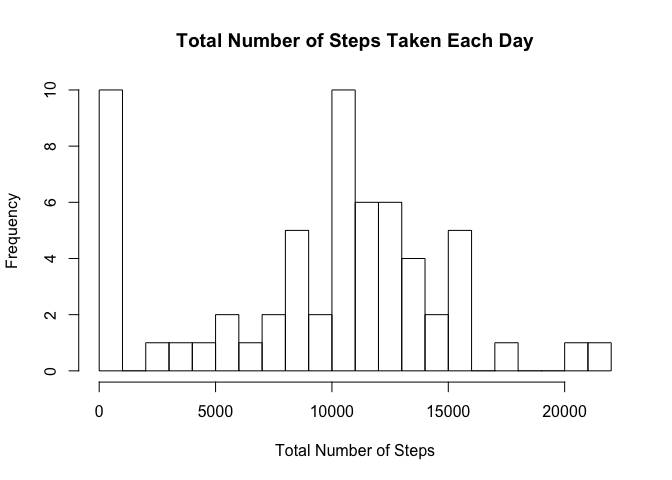
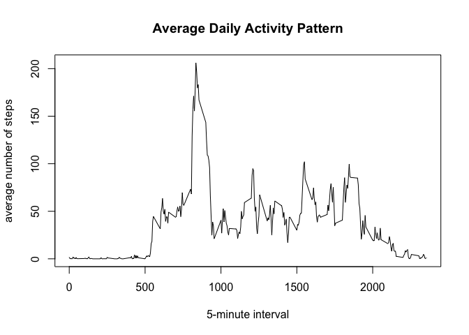
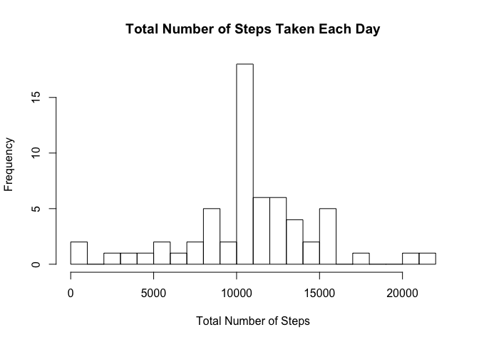

# Reproducible Research: Peer Assessment 1

## Loading and preprocessing the data
Unzip `activity.zip` in your working directory before reading the data file.  
Note that `fread` is a faster alternative to `read.csv`.


```r
library(data.table)
library(lubridate)

activity <- fread("activity.csv")
activity$date <- ymd(activity$date)
```

## What is mean total number of steps taken per day?
1. Make a histogram of the total number of steps taken each day


```r
total_steps_by_date <- activity[, list(total_steps = sum(steps, na.rm = TRUE)), by = date]
hist(total_steps_by_date$total_steps, main = "Total Number of Steps Taken Each Day", 
     xlab = "Total Number of Steps", breaks = 20)
```



2. Calculate and report the **mean** and **median** total number of steps taken per day

```r
mean(total_steps_by_date$total_steps, na.rm = TRUE)
```

```
## [1] 9354.23
```

```r
median(total_steps_by_date$total_steps, na.rm = TRUE)
```

```
## [1] 10395
```
The **mean** total number of steps taken each day is 9354.2295082.   
The **median** total number of steps taken each day is 10395.

## What is the average daily activity pattern?
1. Make a time series plot of the 5-minute interval and the average number of steps taken, averaged across all days

```r
daily_activity_pattern <- activity[, list(avg_steps = mean(steps, na.rm = TRUE)), by = interval]
plot(avg_steps ~ interval, data = daily_activity_pattern,
     main = "Average Daily Activity Pattern", type = "l", 
     xlab = "5-minute interval", ylab = "average number of steps")
```



2. Which 5-min interval, on average across all the days in the dataset, contains the maximum number of steps?

```r
daily_activity_pattern[which.max(daily_activity_pattern$avg_steps), interval]
```

```
## [1] 835
```
Interval 835 contains the maximum number of steps.

## Imputing missing values
1. Calculate and report the total number of missing values in the dataset

```r
sum(is.na(activity$steps))
```

```
## [1] 2304
```
The total number of missing values is 2304.

2. Devise a strategy for filling in all of the missing values in the dataset  
We will impute the mean number of steps, averaged across all days, into the steps variable.

3. Create a new dataset with the missing data filled in  
`copy` makes a copy of the original `activity` object. `setDT` is used to change `activity_imp` by reference.   


```r
lookup <- setNames(daily_activity_pattern$avg_steps, daily_activity_pattern$interval)
activity_imp <- copy(activity)
activity_imp[, steps := as.numeric(steps)]
setDT(activity_imp)[which(is.na(activity_imp$steps)), steps := lookup[as.character(interval)]]
```

4. What is the impact of imputing missing data on the estimates of the total daily number of steps?

```r
total_steps_by_date_imp <- activity_imp[, list(total_steps = sum(steps, na.rm = TRUE)), by = date]
hist(total_steps_by_date_imp$total_steps, main = "Total Number of Steps Taken Each Day", 
     xlab = "Total Number of Steps", breaks = 20)
```



```r
mean(total_steps_by_date_imp$total_steps, na.rm = TRUE)
```

```
## [1] 10766.19
```

```r
median(total_steps_by_date_imp$total_steps, na.rm = TRUE)
```

```
## [1] 10766.19
```
The **mean** and **median** total number of steps taken each day differ from the previous results. The **mean** and **median** values should depend on the distrubution of the missing values.

## Are there differences in activity patterns between weekdays and weekends?
1. Create a new factor variable in the dataset with two levels – “weekday” and “weekend” indicating whether a given date is a weekday or weekend day  


```r
activity_imp[, day := factor(weekdays(activity_imp$date) %in% c("Saturday", "Sunday"), labels = c("weekday", "weekend"))]
```

2. Make a panel plot containing a time series plot


```r
daily_activity_pattern_by_day <- activity_imp[, list(avg_steps = mean(steps, na.rm = TRUE)), by = list(day, interval)]

library(lattice)
xyplot(avg_steps ~ interval | day, data = daily_activity_pattern_by_day,
     type = "l", layout = c(1, 2),
     xlab = "Interval", ylab = "Number of steps")
```


Weekdays show different activity patterns from weekends.  
